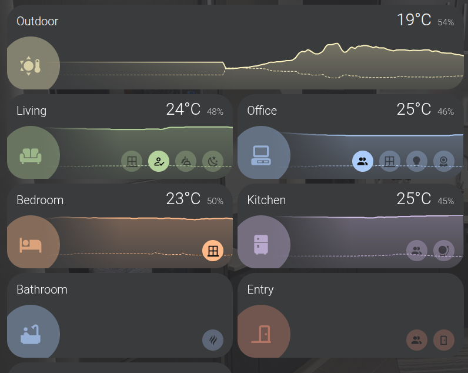
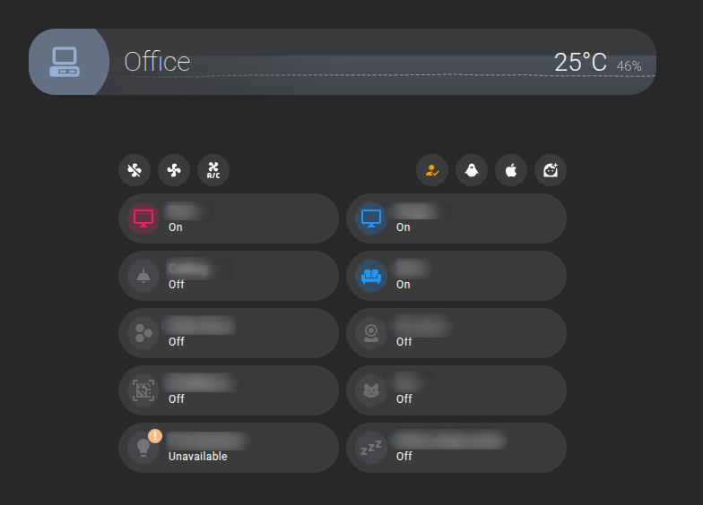
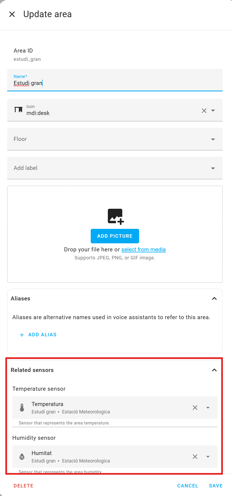
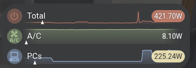

# SC Custom Cards

Provides multiple custom cards for Home Assistant, including a room card and a bars card.


## Table of Contents
- [Installation](#installation)
- [Room Card](#room-card)
  - [Features](#features)
  - [Configuration](#configuration)
    - [Configuration Options](#configuration-options)
    - [ActionConfig](#actionconfig)
    - [Example Configuration](#example-configuration)
    - [Example Use Cases](#example-use-cases)
  - [History Bars Card](#history-bars-card)
    - [Configuration Options](#configuration-options-1)
    - [Example Configuration](#example-configuration-1)
    - [Example Use Cases](#example-use-cases-1)
- [Troubleshooting](#troubleshooting)
- [Support](#support)


## Installation
1. **Install via HACS**:
  - Add this repository to HACS.
  - Search for "SC Custom Cards" in the HACS store and install it.
2. **Manual Installation**:
  - Download the latest release from the GitHub repository.
  - Place the files in your Home Assistant `www` folder.
  - Add the resource to your Lovelace configuration:
    ```yaml
    resources:
      - url: /local/sc-custom-cards/sc-custom-cards.js
        type: module
    ```


## Room Card

Room Card is a custom Lovelace card for Home Assistant that displays information about a room, including temperature, humidity.
It can also summarize device type statuses. For example can summarize the status of room lights, If one light is on it will show light icon as on, if all lights are off it will show light icon as off.

It is designed to provide a clean and customizable interface for monitoring and controlling devices in a specific area.



Using `style: header` the card will render in a header style, showing the room name and a summary of the devices in that room. That is useful for a custom dashboard for the room.




### Features
- Displays room-specific data such as temperature, humidity, and device statuses.
- Supports alarms, lights, doors, windows, and other entities.
- Fully customizable layout and appearance.
- Responsive design that adapts to different screen sizes.

### Configuration
To use the Room Card, add it to your Lovelace dashboard. `type: custom:sc-area-card`

#### Configuration Options
| Option                | Type       | Required | Description                                                          |
|-----------------------|------------|----------|----------------------------------------------------------------------|
| `area`                | `string`   | Yes      | The area or room to display information for.                         |
| `style`               | `string`   | No       | The style of the card (e.g., `header`, `full`).  (`full` by default) |
| `color`               | `string`   | No       | The color of the card (e.g., `#f90`, `var(--green)`).                |
| `summary`             | `array`    | No       | A list of entity groups to summarize (e.g., lights, doors, windows). |
| `summary[].name`      | `string`   | Yes      | The name of the entity group.                                        |
| `summary[].icon`      | `string`   | Yes      | The icon to represent the entity group.                              |
| `summary[].entities`  | `array`    | Yes      | A list of entity IDs for the group.                                  |
| `summary[].alarm_entities` | `array` | No       | A list of of entities to show as alarms.                             |
| `tap_action`         | `ActionConfig`   | No       | Action to perform on tap (e.g., navigate to another view).           |
| `hold_action`        | `ActionConfig`   | No       | Action to perform on hold (e.g., show more details).                 |
| `double_tap_action`  | `ActionConfig`   | No       | Action to perform on double tap (e.g., toggle a device).             |

The cards provides predefined entity groups for `lights`, `doors`, `windows`, and `alarms`.

#### ActionConfig
| Option                | Type       | Required | Description                                                          |
|-----------------------|------------|----------|----------------------------------------------------------------------|
| `action`              | `string`   | Yes      | The action to perform (e.g., `more-info`, `navigate`).               |
| `navigation_path`     | `string`   | No       | The path to navigate to (if applicable).                             |


> NOTE: Temperature and humidity sensors are automatically detected based on the area configuration in Home Assistant. Ensure that your sensors are correctly set up in the Home Assistant UI.
> 
> 

#### Example Configuration
Below is an example configuration:

```yaml
type: custom:sc-area-card
area: living_room
summary:
  - name: Lights
    icon: mdi:lightbulb
    entities:
      - light.living_room_main
      - light.living_room_lamp
    alarm_entities:
      - binary_sensor.living_room_smoke_alarm
  - name: Doors
    icon: mdi:door
    entities:
      - binary_sensor.living_room_door
    alarm_entities:
      - binary_sensor.living_room_door_alarm
  - name: Windows
    icon: mdi:window-closed
    entities:
      - binary_sensor.living_room_window
    alarm_entities:
      - binary_sensor.living_room_window_alarm
presence:
  - binary_sensor.living_room_occupancy
```

#### Example Use Cases
1. **Living Room Monitoring**:
   Monitor the temperature, humidity, and status of lights, doors, and windows in the living room.
2. **Bedroom Control**:
   Display the status of alarms, lights, and environmental sensors in the bedroom.


## History Bars Card 
The History Bars Card is a custom Lovelace card for Home Assistant that displays historical data in a bar 
chart format. It allows you to visualize the history of various entities over time and the instant value 
at the same time.


### Features
- Displays historical data for multiple entities in a bar chart format.
- Supports thresholds for visualizing data above or below a certain value.
- Customizable colors and time ranges.
- Responsive design that adapts to different screen sizes.




### Configuration
To use the History Bars Card, add it to your Lovelace dashboard. `type: custom:sc-bars-card`.

#### Configuration Options
| Option              | Type     | Required | Description                                                                     |
|---------------------|----------|----------|---------------------------------------------------------------------------------|
| `entities`          | `array`  | Yes      | A list of entity IDs to display in the chart.                                   |
| `max`               | `number` | Yes      | The max value for all entities to allow to compare instant value.               |
| `thresholds`        | `array`  | No       | A list of thresholds for coloring the bars based on values.                     |
| `thresholds[].value` | `number` | Yes      | The threshold value.                                                            |
| `thresholds[].color` | `string` | Yes      | The color to use for the threshold (e.g., `#f90`, `var(--red)`).                |
| `entities[].entity` | `string` | Yes      | The entityID.                                                                   |
| `entities[].name`   | `string` | No       | The name to display for the entity.                                             |
| `entities[].icon`   | `string` | No       | The icon to display for the entity.                                             |
| `entities[].color`  | `string` | No       | The color to use for the entity (e.g., `#f90`, `var(--red)`).                   |
| `entities[].thresholds` | `array` | No       | A list of thresholds for coloring the entity bar (overwrites the common values. |
| `entities[].thresholds[].value` | `number` | Yes      | The threshold value for the entity.                                             |
| `entities[].thresholds[].color` | `string` | Yes      | The color to use for the entity threshold (e.g., `#f90`, `var(--red)`).         |


#### Example Configuration
Below is an example configuration:

```yaml
type: custom:sc-bars-card
max: 4000
thresholds:
  - value: 501
    color: var(--info-color)
  - value: 1001
    color: var(--warning-color)
  - value: 1501
    color: var(--error-color)
entities:
  - entity: sensor.power_meter_power_a
    name: Total
    icon: mdi:power
    color: var(--red)
  - entity: sensor.power_meter_power_b
    name: A/C
    icon: mdi:air-conditioner
    color: var(--green)
  - entity: sensor.ventilador_mss310_power_w_main_channel
    name: PCs
    icon: mdi:desktop-classic
    color: var(--blue)
    thresholds:
    - value: 101
      color: var(--info-color)
    - value: 201
      color: var(--warning-color)
    - value: 301
      color: var(--error-color)
```

## Troubleshooting
- Ensure the card is installed correctly and added as a resource in your Lovelace configuration.
- Check the browser console for errors if the card does not load.
- Verify that the entity IDs in your configuration exist in your Home Assistant setup.

## Support
For issues or feature requests, please visit the [GitHub repository](https://github.com/sergiocarracedo/sc-custom-cards) and open an issue.
