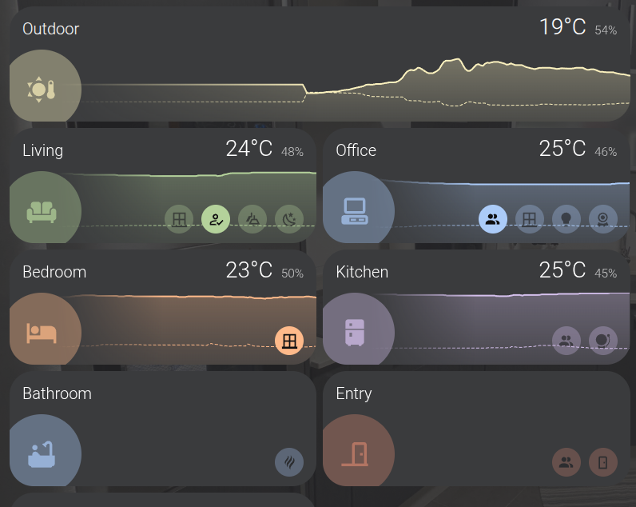
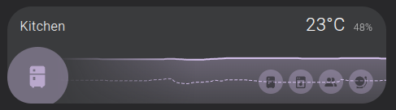
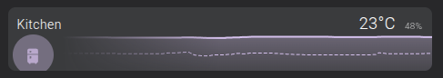
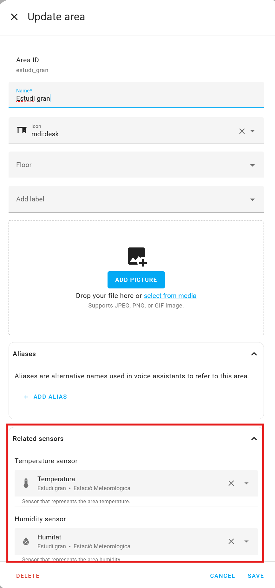
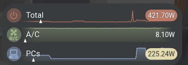

# SC Custom Cards

Provides multiple custom cards for Home Assistant, including an area card and a history bars card.

## Automated Releases

This repository uses `release-please` to open a release PR after changes land on `main`.
When that PR passes `CI`, GitHub Actions merges it automatically, creates the GitHub release, builds the bundle, and uploads `dist/sc-custom-cards.js` as a release asset.

The repository also supports a fully automatic `beta` release channel. Merges to `beta` follow the same flow, but publish prereleases such as `v1.7.1-beta.1` that can be used for testing before promoting changes to `main`.

To keep the process fully automatic, add a repository secret named `RELEASE_PLEASE_TOKEN` with permissions to create and merge pull requests, push to `main`, create releases, and trigger follow-up workflows.
Without that secret, GitHub falls back to `GITHUB_TOKEN`, which usually cannot trigger the PR and push workflows required to finish the full release flow.

### Beta Channel

Use the long-lived `beta` branch as the prerelease lane.

How it works:
- open normal feature and fix PRs against `beta` when you want to test changes before shipping them to `main`
- when a PR is merged into `beta`, `release-please` opens or updates a beta release PR
- after `CI` succeeds, GitHub Actions merges that release PR automatically
- the merge publishes a GitHub prerelease and uploads `dist/sc-custom-cards.js`

Version behavior:
- each merge into `beta` can produce a new prerelease version when there are releasable commits
- `fix:` commits produce patch prereleases such as `v1.7.1-beta.1`, then `v1.7.1-beta.2`
- `feat:` commits produce minor prereleases such as `v1.8.0-beta.1`
- breaking changes produce the next major prerelease version

To test beta versions in HACS, enable beta versions for the repository in HACS before checking for updates.

## Local Development

For local development, the Vite build can copy `dist/sc-custom-cards.js` directly into your Home Assistant HACS install after each build or watch rebuild.

Create a local `.env.local` file in the repository root. It is ignored by git and loaded automatically when Vite runs. You can also keep using `.env` if you already have one, but `.env.local` is the preferred file for personal machine settings.

Example:

```bash
HA_SYNC_TARGET=root@homeassistant.local:/config/www/community/sc-custom-cards/sc-custom-cards.js
```

Notes:
- `HA_SYNC_TARGET` is the preferred variable name
- `HA_SCP_TARGET` is still accepted as a fallback for older local setups
- the recommended target is the HACS-installed file path, so local builds update the same file Home Assistant loads from `/hacsfiles/sc-custom-cards/sc-custom-cards.js`
- if the copy fails, the build now fails loudly instead of silently continuing

Typical workflow:
- run `pnpm build` for a one-off build and sync
- run `pnpm dev` to watch, rebuild, and sync automatically after changes

## Table of Contents

- [Installation](#installation)
- [Visual Editor](#visual-editor)
- [Supported Languages](#supported-languages)
- [Room Card](#room-card)
  - [Features](#features)
  - [Configuration](#configuration)
    - [Configuration Options](#configuration-options)
    - [ActionConfig](#actionconfig)
    - [Example Configuration](#example-configuration)
    - [Example Use Cases](#example-use-cases)
  - [History Bars Card](#history-bars-card)
    - [Configuration Options](#configuration-options-1)
    - [Example Configuration](#example-configuration-1)
    - [Example Use Cases](#example-use-cases-1)
- [Troubleshooting](#troubleshooting)
- [Support](#support)

## Installation

1. **Install via HACS**:

- Add this repository to HACS.
- Search for "SC Custom Cards" in the HACS store and install it.

2. **Manual Installation**:

- Download the latest release from the GitHub repository.
- Place the files in your Home Assistant `www` folder.
- Add the resource to your Lovelace configuration:
  ```yaml
  resources:
    - url: /local/sc-custom-cards/sc-custom-cards.js
      type: module
  ```

## Visual Editor

All cards include a **visual configuration editor** that allows you to configure the cards without writing YAML. The visual editor provides:

- **Interactive Forms**: Configure card options through intuitive forms with dropdowns, color pickers, and entity selectors
- **Drag and Drop**: Reorder entities, thresholds, and summary items easily
- **Inline Editing**: Click the edit button on any item to modify its properties
- **Real-time Preview**: See changes immediately in the card preview

To use the visual editor:

1. Add a card to your dashboard
2. Search for "SC Custom Cards" and select the card type
3. Use the visual editor interface to configure your card
4. Switch to "Show Code Editor" anytime to view or edit the YAML configuration

> **Note**: The visual editor supports all card features. Some advanced configurations may still require YAML editing.

## Supported Languages

SC Custom Cards includes translations for the following languages:

- 🇺🇸 **English** (en)
- 🇪🇸 **Spanish** (es) - Español
- 🇫🇷 **French** (fr) - Français
- 🇩🇪 **German** (de) - Deutsch
- 🇮🇹 **Italian** (it) - Italiano
- 🇳🇱 **Dutch** (nl) - Nederlands
- 🇵🇱 **Polish** (pl) - Polski
- 🇸🇪 **Swedish** (sv) - Svenska
- 🇳🇴 **Norwegian** (no) - Norsk
- 🇫🇮 **Finnish** (fi) - Suomi
- 🇩🇰 **Danish** (da) - Dansk
- 🇨🇿 **Czech** (cs) - Čeština
- 🇭🇺 **Hungarian** (hu) - Magyar
- 🇷🇴 **Romanian** (ro) - Română
- 🇧🇬 **Bulgarian** (bg) - Български
- 🇬🇷 **Greek** (el) - Ελληνικά
- 🇷🇺 **Russian** (ru) - Русский
- 🇺🇦 **Ukrainian** (uk) - Українська
- 🇹🇷 **Turkish** (tr) - Türkçe
- 🇰🇷 **Korean** (ko) - 한국어
- 🇯🇵 **Japanese** (ja) - 日本語
- 🇨🇳 **Chinese** (zh) - 中文
- 🇧🇷 **Portuguese (BR)** (pt-BR) - Português (Brasil)
- 🇵🇹 **Portuguese** (pt) - Português
- 🇲🇽 **Spanish (Mexico)** (es-MX) - Español (México)
- 🇨🇦 **French (Canada)** (fr-CA) - Français (Canada)
- 🇦🇺 **English (Australia)** (en-AU) - English (Australia)
- 🇬🇧 **English (UK)** (en-GB) - English (UK)

Translations cover:

- Card names and descriptions
- Configuration form labels
- Button labels (Add, Edit, Delete, Back)
- Action names (Tap, Hold, Double Tap)
- Section headers

To add support for a new language or improve existing translations, please contribute via the [translations folder](.translations/).

## Room Card

Room Card is a custom Lovelace card for Home Assistant that displays information about a room, including temperature, humidity.
It can also summarize device type statuses. For example can summarize the status of room lights, If one light is on it will show light icon as on, if all lights are off it will show light icon as off.

It is designed to provide a clean and customizable interface for monitoring and controlling devices in a specific area.



Using `style: header` the card will render in a header style, showing the room name and a summary of the devices in that room. That is useful for a custom dashboard for the room.


**Compact variant** (smaller sizes, ideal for dashboards with many cards):



**Mini variant** (even smaller, perfect for compact layouts):



### Features

- Displays room-specific data such as temperature, humidity, and device statuses.
- Supports alarms, lights, doors, windows, and other entities.
- Fully customizable layout and appearance.
- Responsive design that adapts to different screen sizes.

### Configuration

To use the Room Card, add it to your Lovelace dashboard. `type: custom:sc-area-card`

#### Configuration Options

| Option                        | Type           | Required | Description                                                                         |
| ----------------------------- | -------------- | -------- | ----------------------------------------------------------------------------------- |
| `area`                        | `string`       | Yes      | The area or room to display information for.                                        |
| `style`                       | `string`       | No       | The style of the card (e.g., `header`, `full`). (`full` by default)                 |
| `variant`                     | `string`       | No       | The size variant of the card (`default`, `compact`, `mini`). (`default` by default) |
| `color`                       | `string`       | No       | The color of the card (e.g., `#f90`, `var(--green)`).                               |
| `summary`                     | `array`        | No       | A list of entity groups to summarize (e.g., lights, doors, windows).                |
| `summary[].name`              | `string`       | Yes      | The name of the entity group.                                                       |
| `summary[].icon`              | `string`       | Yes      | The icon to represent the entity group.                                             |
| `summary[].entities`          | `array`        | Yes      | A list of entity IDs for the group.                                                 |
| `summary[].alarm_entities`    | `array`        | No       | A list of of entities to show as alarms.                                            |
| `summary[].tap_action`        | `ActionConfig` | No       | Action to perform on tap in summary (e.g., navigate to another view).               |
| `summary[].hold_action`       | `ActionConfig` | No       | Action to perform on hold in summary (e.g., show more details).                     |
| `summary[].double_tap_action` | `ActionConfig` | No       | Action to perform on double tap in summary(e.g., toggle a device).                  |
| `tap_action`                  | `ActionConfig` | No       | Action to perform on tap in card (e.g., navigate to another view).                  |
| `hold_action`                 | `ActionConfig` | No       | Action to perform on hold in card (e.g., show more details).                        |
| `double_tap_action`           | `ActionConfig` | No       | Action to perform on double tap in card (e.g., toggle a device).                    |

The cards provides predefined entity groups for `lights`, `doors`, `windows`, and `alarms`.

> NOTE: The summary actions related to entities like toogle will be applied to all entities defined for the summary.

#### ActionConfig

| Option            | Type     | Required | Description                                            |
| ----------------- | -------- | -------- | ------------------------------------------------------ |
| `action`          | `string` | Yes      | The action to perform (e.g., `more-info`, `navigate`). |
| `navigation_path` | `string` | No       | The path to navigate to (if applicable).               |

> NOTE: Temperature and humidity sensors are automatically detected based on the area configuration in Home Assistant. Ensure that your sensors are correctly set up in the Home Assistant UI.
>
> 

#### Example Configuration

Below is an example configuration:

```yaml
type: custom:sc-area-card
area: living_room
summary:
  - name: Lights
    icon: mdi:lightbulb
    entities:
      - light.living_room_main
      - light.living_room_lamp
    alarm_entities:
      - binary_sensor.living_room_smoke_alarm
  - name: Doors
    icon: mdi:door
    entities:
      - binary_sensor.living_room_door
    alarm_entities:
      - binary_sensor.living_room_door_alarm
  - name: Windows
    icon: mdi:window-closed
    entities:
      - binary_sensor.living_room_window
    alarm_entities:
      - binary_sensor.living_room_window_alarm
presence:
  - binary_sensor.living_room_occupancy
```

#### Example Use Cases

1. **Living Room Monitoring**:
   Monitor the temperature, humidity, and status of lights, doors, and windows in the living room.
2. **Bedroom Control**:
   Display the status of alarms, lights, and environmental sensors in the bedroom.

**Using variants for compact layouts:**

```yaml
type: custom:sc-area-card
area: kitchen
variant: compact # or 'mini' for even smaller
style: header
summary:
  - name: Appliances
    icon: mdi:fridge
    entities:
      - switch.kitchen_fridge
      - switch.kitchen_microwave
```

## History Bars Card

The History Bars Card is a custom Lovelace card for Home Assistant that displays historical data in a bar
chart format. It allows you to visualize the history of various entities over time and the instant value
at the same time.

### Features

- Displays historical data for multiple entities in a bar chart format.
- Supports thresholds for visualizing data above or below a certain value.
- Customizable colors and time ranges.
- Responsive design that adapts to different screen sizes.



### Configuration

To use the History Bars Card, add it to your Lovelace dashboard. `type: custom:sc-bars-card`.

#### Configuration Options

| Option                          | Type           | Required | Description                                                                     |
| ------------------------------- | -------------- | -------- | ------------------------------------------------------------------------------- |
| `entities`                      | `array`        | Yes      | A list of entity IDs to display in the chart.                                   |
| `max`                           | `number`       | Yes      | The max value for all entities to allow to compare instant value.               |
| `thresholds`                    | `array`        | No       | A list of thresholds for coloring the bars based on values.                     |
| `thresholds[].value`            | `number`       | Yes      | The threshold value.                                                            |
| `thresholds[].color`            | `string`       | Yes      | The color to use for the threshold (e.g., `#f90`, `var(--red)`).                |
| `entities[].entity`             | `string`       | Yes      | The entityID.                                                                   |
| `entities[].name`               | `string`       | No       | The name to display for the entity.                                             |
| `entities[].icon`               | `string`       | No       | The icon to display for the entity.                                             |
| `entities[].color`              | `string`       | No       | The color to use for the entity (e.g., `#f90`, `var(--red)`).                   |
| `entities[].thresholds`         | `array`        | No       | A list of thresholds for coloring the entity bar (overwrites the common values. |
| `entities[].thresholds[].value` | `number`       | Yes      | The threshold value for the entity.                                             |
| `entities[].thresholds[].color` | `string`       | Yes      | The color to use for the entity threshold (e.g., `#f90`, `var(--red)`).         |
| `entities[].tap_action`         | `ActionConfig` | No       | Action to perform on tap in bar (e.g., navigate to another view).               |
| `entities[].hold_action`        | `ActionConfig` | No       | Action to perform on hold in bar (e.g., show more details).                     |
| `entities[].double_tap_action`  | `ActionConfig` | No       | Action to perform on double tap in bar (e.g., toggle a device).                 |

#### Example Configuration

Below is an example configuration:

```yaml
type: custom:sc-bars-card
max: 4000
thresholds:
  - value: 501
    color: var(--info-color)
  - value: 1001
    color: var(--warning-color)
  - value: 1501
    color: var(--error-color)
entities:
  - entity: sensor.power_meter_power_a
    name: Total
    icon: mdi:power
    color: var(--red)
  - entity: sensor.power_meter_power_b
    name: A/C
    icon: mdi:air-conditioner
    color: var(--green)
  - entity: sensor.ventilador_mss310_power_w_main_channel
    name: PCs
    icon: mdi:desktop-classic
    color: var(--blue)
    thresholds:
      - value: 101
        color: var(--info-color)
      - value: 201
        color: var(--warning-color)
      - value: 301
        color: var(--error-color)
```

## Troubleshooting

- Ensure the card is installed correctly and added as a resource in your Lovelace configuration.
- Check the browser console for errors if the card does not load.
- Verify that the entity IDs in your configuration exist in your Home Assistant setup.

## Support

For issues or feature requests, please visit the [GitHub repository](https://github.com/sergiocarracedo/sc-custom-cards) and open an issue.
